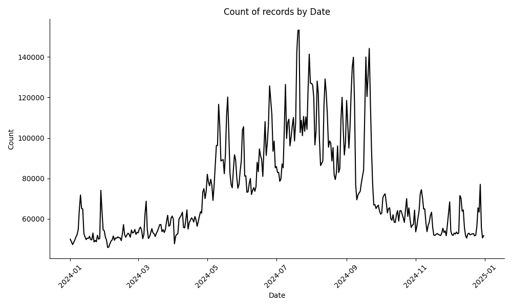
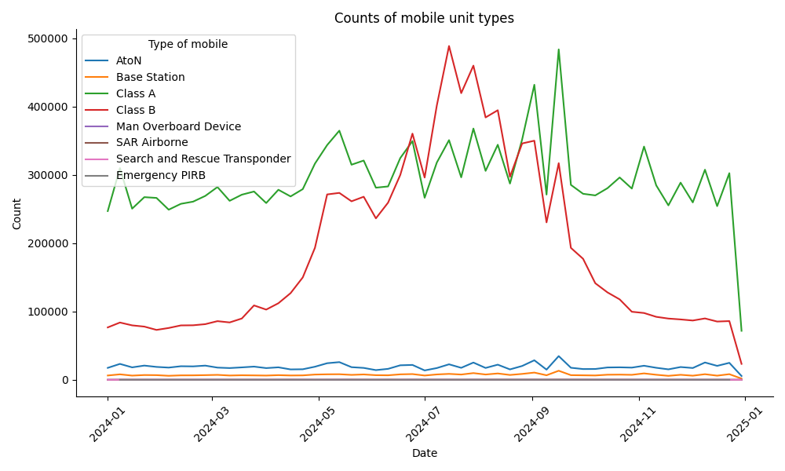
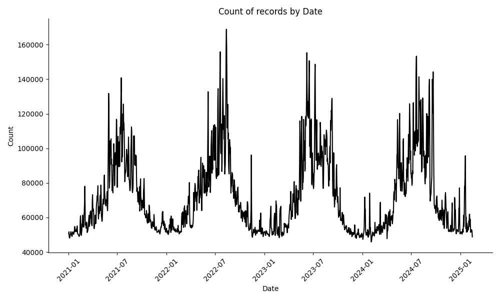
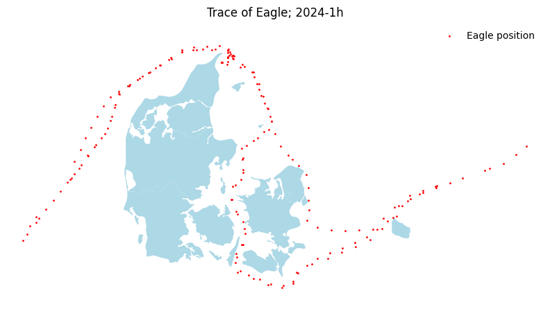
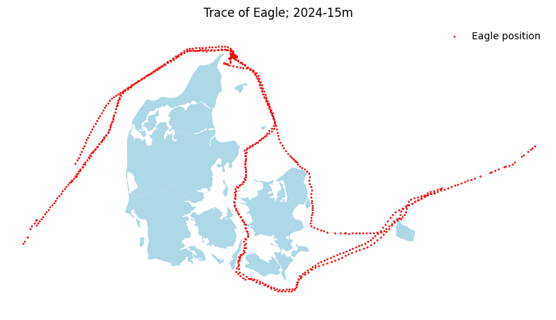
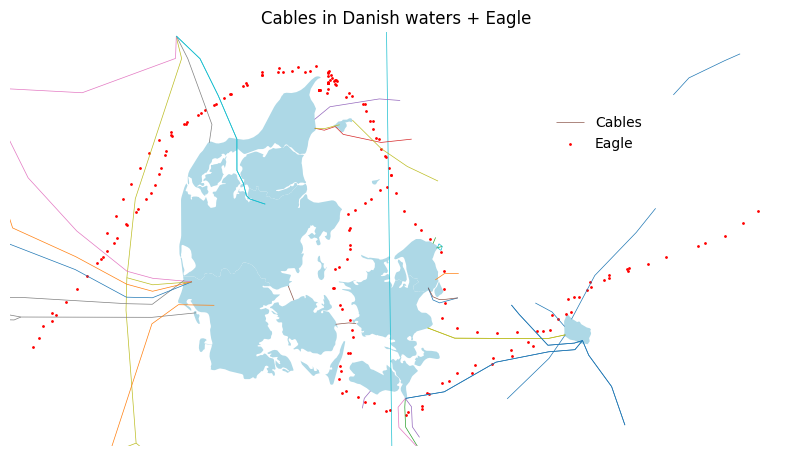

# SODAS Data Sprint February 28th 2025

## Data

- Data is stored at [tresorit](https://tresorit.com/); check your e-mail for
  the link
- The data is saved as parquet files
  - Can be read with
    [polars](https://docs.pola.rs/api/python/dev/reference/api/polars.read_parquet.html)
    or
    [pandas](https://pandas.pydata.org/docs/reference/api/pandas.read_parquet.html)
- The schema of the datasets provided is (convert to Danish time + categoricals
  if you like):

```python
Schema([('MMSI', String),
        ('# Timestamp', Datetime(time_unit='us', time_zone=None)),
        ('Type of mobile', String),
        ('Latitude', Float64),
        ('Longitude', Float64),
        ('Navigational status', String),
        ('ROT', Float64),
        ('SOG', Float64),
        ('COG', Float64),
        ('Heading', Float64),
        ('IMO', String),
        ('Callsign', String),
        ('Name', String),
        ('Ship type', String),
        ('Cargo type', String),
        ('Width', Float64),
        ('Length', Float64),
        ('Type of position fixing device', String),
        ('Draught', Float64),
        ('Destination', String),
        ('ETA', Datetime(time_unit='us', time_zone=None)),
        ('Data source type', String),
        ('A', Float64),
        ('B', Float64),
        ('C', Float64),
        ('D', Float64)])
```

- [Slides](https://jsr-p.github.io/slides/data-sprint-feb25/#/title-slide)
- See also the [original documentation.](http://web.ais.dk/aisdata/!_README_information_CSV_files.txt)
- The data has been transformed from the original [zip
  files](http://web.ais.dk/aisdata/) to the parquet files stored on
  [tresorit](https://tresorit.com/) using the script
  [here](scripts/zip_proc.py)

### Reading a slice of it

- See [script](scripts/load.py)

### Inspect 2024

- See [script](scripts/queries.py)





### Inspect 2021-2025

- See [script](scripts/queries-all.py)



### Tracing Eagle 🦅

- See [script](scripts/trace_eagle.py)

**Every hour:**



**Every 15 minutes:**



- See [script](scripts/cables.py)



## Installation

```bash
uv venv
# On Windows replace with: .venv\Scripts\activate
source .venv/bin/activate
uv pip install -e .
```
