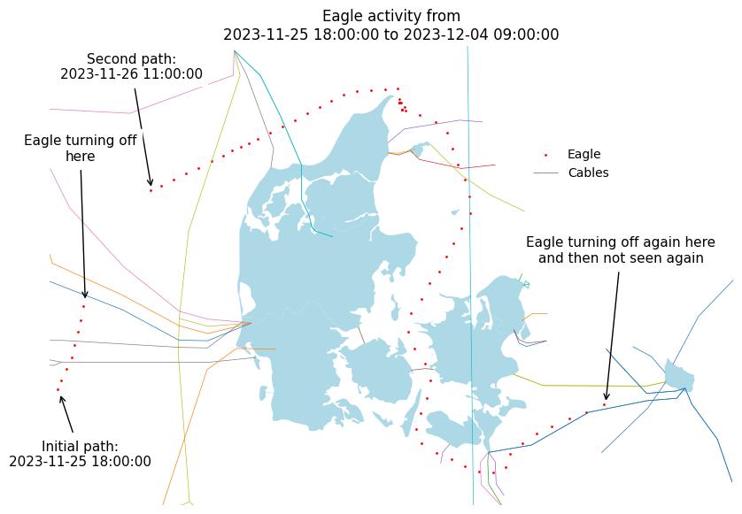
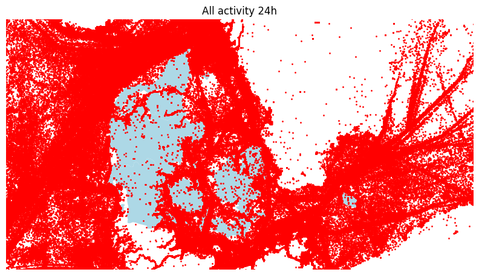

# Results from Data Sprint

## Annotated trace of 🦅

### Not due to AIS signal not strong enough

**All activity scatter plot:**

## GIFs of 🦅

### Turning on and off 1

    <h3>2023-11-25 18:00:00</h3>
    

    <h3>2023-11-26 11:00:00</h3>
    

### Turning on and off 2

    <h3>2024-07-04 15:00:00</h3>
    

    <h3>2024-07-07 14:00:00</h3>
    

### Others

    <h3>2023-12-18 23:00:00</h3>
    

    <h3>2023-12-24 20:00:00</h3>
    

    <h3>2024-06-17 10:00:00</h3>
    

    <h3>2024-10-14 14:00:00</h3>
    

